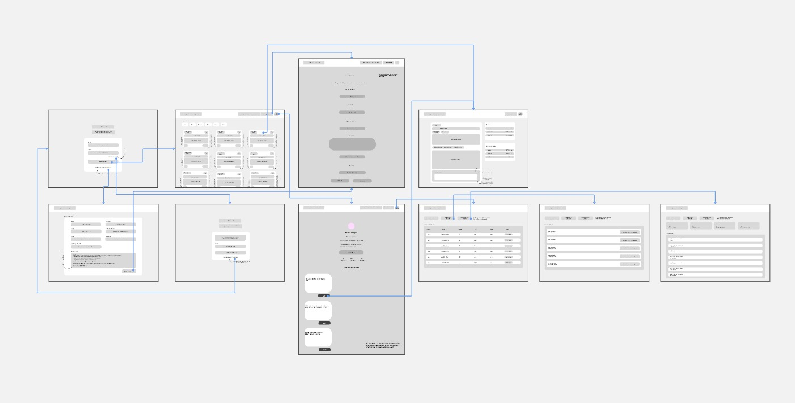
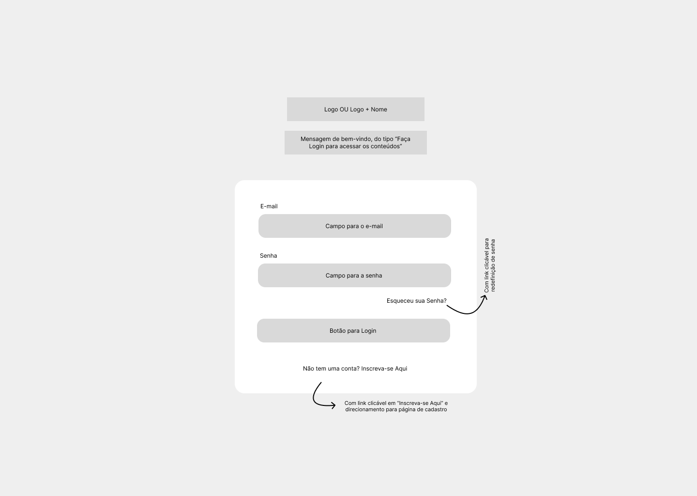
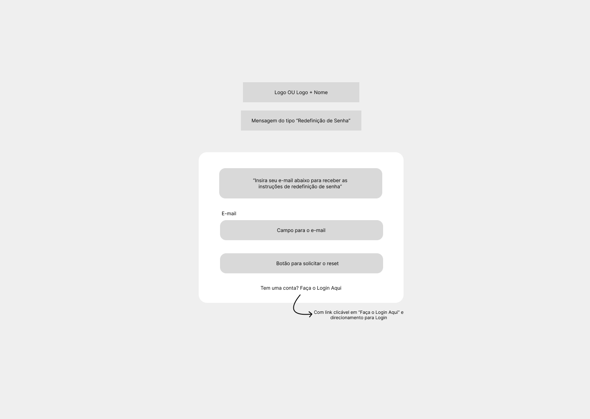
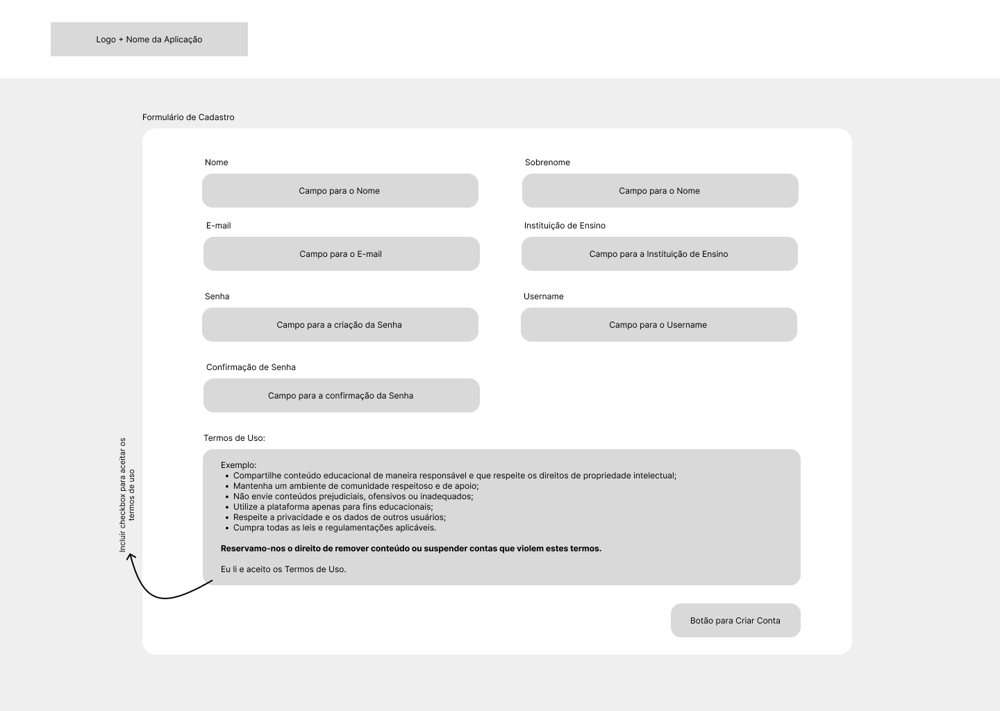
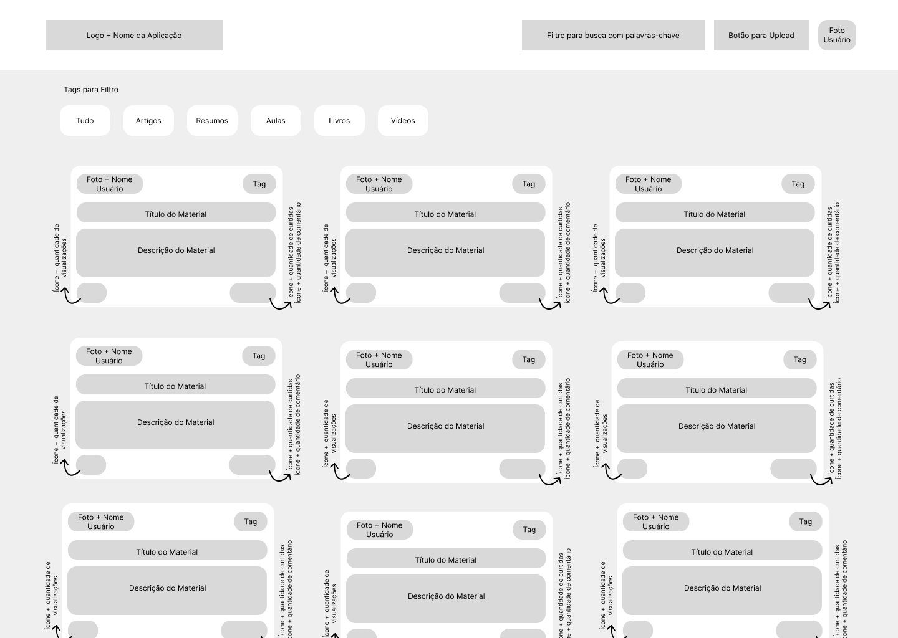
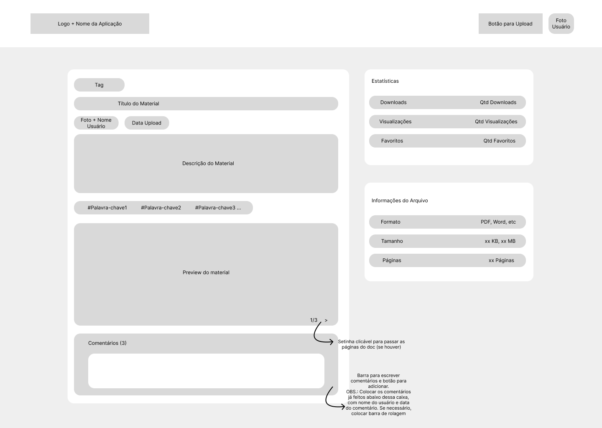
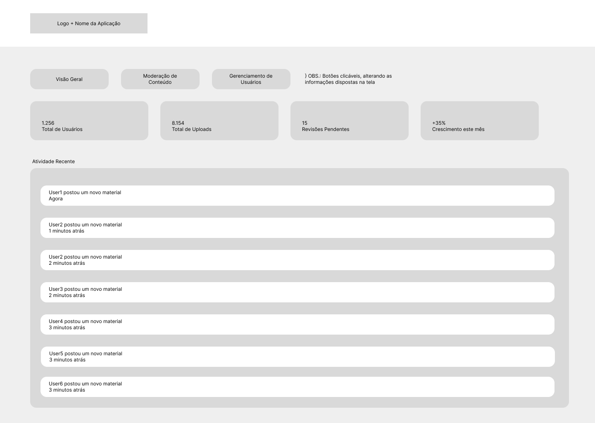
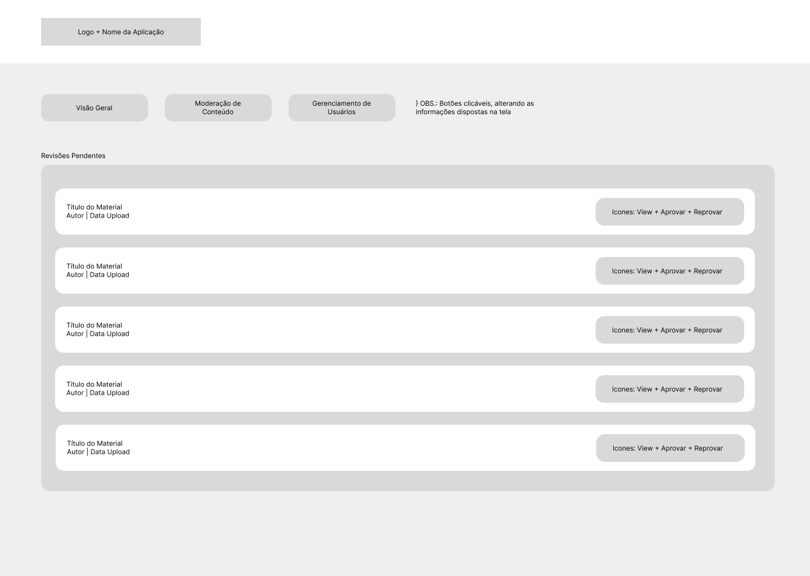

# Projeto de Interface

 O Projeto de Interface foi elaborada de forma a atender os requisitos funcionais, não funcionais e histórias de usuário abordados na <a href="2-Especificação do Projeto.md"> Documentação de Especificação</a>.

## User Flow

||
|:--------------------------------------------------------------------------------------------:|
| **Figura 1: User Flow** 

Fluxo de usuário (User Flow) é uma técnica que permite ao desenvolvedor mapear todo fluxo de telas do site ou app. 

## Wireframes

São protótipos usados em design de interface para sugerir a estrutura de um site web e seu relacionamentos entre suas páginas. Um wireframe web é uma ilustração semelhante do layout de elementos fundamentais na interface e é fundamental sempre relacionar cada wireframe com o(s) requisito(s) que ele atende.

### Tela de Login

||
|:--------------------------------------------------------------------------------------------:|
| **Figura 2: Tela de Login** 

### Tela de Recuperação de Senha

||
|:--------------------------------------------------------------------------------------------:|
| **Figura 3: Tela de Recuperação de Senha** 

| Componente    | Requisitos Atendidos |
| :-------------: | ------------- |
| Tela de Recuperação de Senha  | RF-13: O sistema deve permitir a redefinição de senha através de um link enviado por e-mail ou SMS.  |

### Tela de Cadastro

||
|:--------------------------------------------------------------------------------------------:|
| **Figura 4: Tela de Cadastro** 

| Componente    | Requisitos Atendidos |
| :-------------: | ------------- |
| Tela de Cadastro  | RF-06: O sistema deve permitir a criação de conta e autenticação de usuários.|
 

### Tela Inicial ("Feed") de Postagens de Materiais

||
|:--------------------------------------------------------------------------------------------:|
| **Figura 5: Tela Inicial**   

| Componente    | Requisitos Atendidos |
| :-------------: | ------------- |
| Tela Inicial ("Feed")  | RF-01: O sistema deve permitir que o estudante faça upload de arquivos nos formatos PDF, resumos (texto) e slides.   RF-02: O sistema deve oferecer um motor de busca que permita filtrar materiais por disciplina, curso ou palavras-chave.   RF-04: O sistema deve permitir que usuários "curtam" ou atribuam notas (estrelas/pontuação) aos materiais.   RF-16: O sistema deve exibir no feed principal os materiais e perguntas mais recentes das disciplinas que o usuário selecionou como "Interesses" no perfil.|
 

 ### Tela de Upload de Arquivos

||
|:--------------------------------------------------------------------------------------------:|
| **Figura 6: Tela de Upload de Arquivos**   

| Componente    | Requisitos Atendidos |
| :-------------: | ------------- |
| Tela de Upload  | RF-01: O sistema deve permitir que o estudante faça upload de arquivos nos formatos PDF, resumos (texto) e slides. |

 ### Tela de Perfil do Usuário

||
|:--------------------------------------------------------------------------------------------:|
| **Figura 7: Tela de Perfil do Usuário**   

| Componente    | Requisitos Atendidos |
| :-------------: | ------------- |
| Tela de Perfil  | RF-07: O sistema deve permitir que o estudante visualize e edite suas informações pessoais e histórico de atividades.   RF-08: O sistema deve permitir que um usuário siga outros perfis para receber atualizações de novos conteúdos.|

 ### Tela de Visualização do Conteúdo

||
|:--------------------------------------------------------------------------------------------:|
| **Figura 8: Tela de Visualização de Conteúdo**   

| Componente    | Requisitos Atendidos |
| :-------------: | ------------- |
| Tela de Visualização de Conteúdo  | RF-05: O sistema deve permitir que o usuário salve materiais em uma lista de "Favoritos" para acesso rápido.   RF-11: O sistema deve permitir que usuários denunciem conteúdos e que o administrador visualize e trate esses chamados.   RF-15: O sistema deve permitir que o usuário visualize as primeiras 3 páginas de um PDF antes de decidir fazer o download ou favoritar.|  

 ### Tela de Administrador - Visão Geral

||
|:--------------------------------------------------------------------------------------------:|
| **Figura 9: Tela de Visão Geral**   

 ### Tela de Moderação de Conteúdo

||
|:--------------------------------------------------------------------------------------------:|
| **Figura 10: Tela de Moderação de Conteúdo**   

| Componente    | Requisitos Atendidos |
| :-------------: | ------------- |
| Tela de Perfil  | RF-10: O sistema deve permitir que o administrador remova ou edite conteúdos publicados.   RF-11: O sistema deve permitir que usuários denunciem conteúdos e que o administrador visualize e trate esses chamados. |  
 
 ### Tela de Gerenciamento de Usuários

||
|:--------------------------------------------------------------------------------------------:|
| **Figura 11: Tela de Gerenciamento de Usuários**   

| Componente    | Requisitos Atendidos |
| :-------------: | ------------- |
| Tela de Perfil  | RF-12: O sistema deve permitir ao administrador banir ou suspender contas que violem os termos de uso. |  
 

> **Links Úteis**:
> - [Protótipos vs Wireframes](https://www.nngroup.com/videos/prototypes-vs-wireframes-ux-projects/)
> - [Ferramentas de Wireframes](https://rockcontent.com/blog/wireframes/)
> - [MarvelApp](https://marvelapp.com/developers/documentation/tutorials/)
> - [Figma](https://www.figma.com/)
> - [Adobe XD](https://www.adobe.com/br/products/xd.html#scroll)
> - [Axure](https://www.axure.com/edu) (Licença Educacional)
> - [InvisionApp](https://www.invisionapp.com/) (Licença Educacional)
